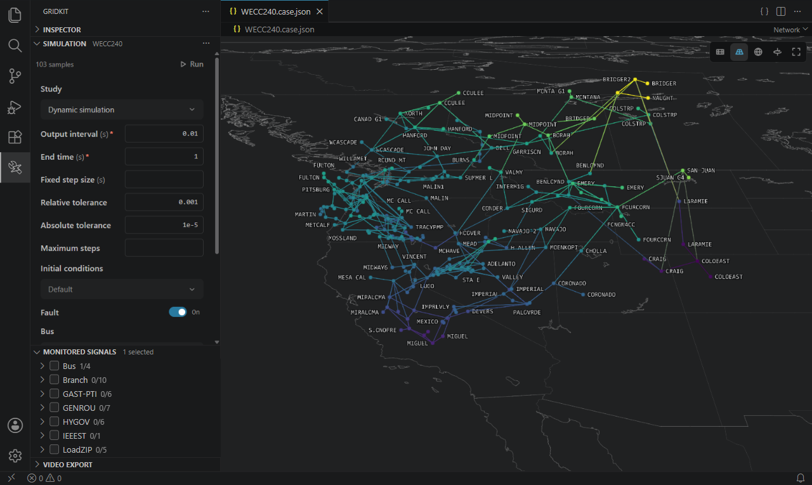
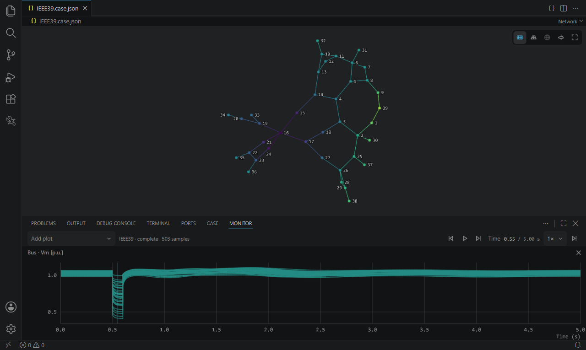

# GridKit Studio

[](https://github.com/lukelowry/gridkit-studio/actions/workflows/ci.yml)
[](https://github.com/ORNL/GridKit/releases/tag/v0.2.0)
[](https://code.visualstudio.com/)
[](https://github.com/lukelowry/gridkit-studio/releases)
[](LICENSE)

View, edit, and simulate [GridKit](https://github.com/ORNL/GridKit) power-system cases in VS Code.



## Install

In VS Code 1.135 or later, run **Extensions: Install from VSIX…**, then open a `*.case.json`. Canvas views need WebGPU.

## Run GridKit

Studio runs the first GridKit it finds:

1. **GridKit Path** (`gridkitStudio.gridkitPath`): an install folder, such as `/opt/gridkit`.
2. GridKit's programs on `PATH` where the workspace is: a dev container, SSH remote, or WSL.
3. **GridKit Image** (`gridkitStudio.gridkitImage`): a container image, run with Docker or Podman. By default `ghcr.io/lukelowry/gridkit:latest`.

Studio never pulls images. Pull it yourself first:

```sh
docker pull ghcr.io/lukelowry/gridkit:latest    # or: podman pull …
```

Runs need a trusted workspace.

## Use

| View                          | Where        |                                                                        |
| ----------------------------- | ------------ | ---------------------------------------------------------------------- |
| Network, Diagram              | Editor       | Draw the case; place, wire, and arrange diagram blocks                 |
| Case                          | Bottom panel | Edit fields; map a column onto the network from its menu               |
| Monitor                       | Bottom panel | Plot and play back runs                                                |
| Simulation, Monitored Signals | Sidebar      | Run a dynamic simulation, or a contingency analysis of every bus fault |
| Video Export                  | Sidebar      | Record Network, Diagram, and Monitor to MP4 or WebM                    |



Every view edits the same JSON document, with native undo, save, and Git. Studio reads what GridKit writes: a member or class its catalog does not know is kept and shown, with a warning. Settings: search `gridkitStudio`.

## Performance

Medians on one Windows workstation, from `pnpm bench`, with GridKit from the default image.

<!-- bench -->

| Case        |  Buses | First frame | Restyle | Camera move | Labels | Simulate 1 s |
| ----------- | -----: | ----------: | ------: | ----------: | -----: | -----------: |
| IEEE39      |     39 |      527 ms |   15 ms |      189 ms | 105 ms |     3,625 ms |
| WECC240     |    243 |      659 ms |   17 ms |      173 ms | 114 ms |     2,574 ms |
| ACTIVSg2000 |  2,000 |      948 ms |   19 ms |      109 ms | 104 ms |     3,857 ms |
| ACTIVSg10k  | 10,000 |    2,304 ms |   21 ms |      109 ms | 104 ms |     6,275 ms |

<!-- /bench -->

## Develop

```sh
pnpm install
pnpm quality           # format, lint, types, unit tests
pnpm test:simulation   # GridKit itself, as Studio runs it
pnpm test:vscode       # VS Code suites, runs included
pnpm bench:update      # benchmarks, recorded here and in tests/benchmarks/work.json
pnpm package           # dist/gridkit-studio-<version>.vsix
```

The GridKit suites run the default image; `GRIDKIT_IMAGE` names another. `cases/` holds [GridKit v0.2.0](https://github.com/ORNL/GridKit/tree/v0.2.0/cases/PhasorDynamics)'s cases without their BusFault devices; `node scripts/cases.mjs ../GridKit v0.2.0` remakes them.

## License

MIT. Bundled code, case data, and map borders: [third-party notices](THIRD_PARTY_NOTICES.md). By [Luke Lowery](https://lukelowry.github.io/).
