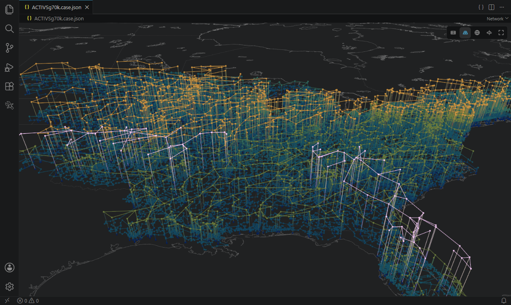
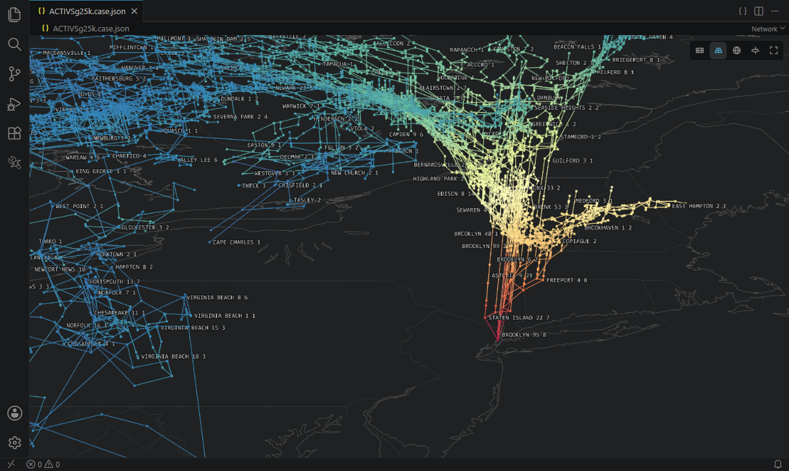
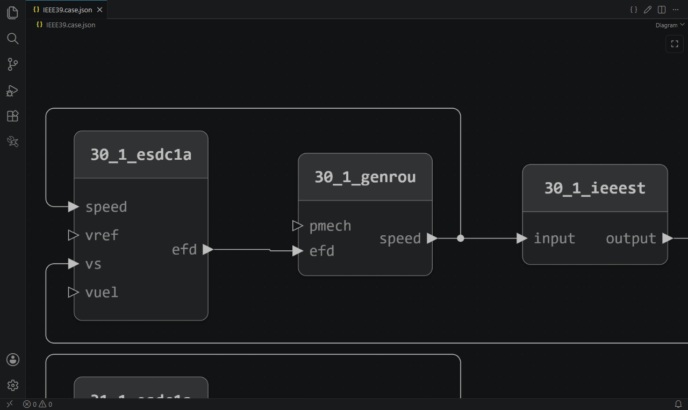
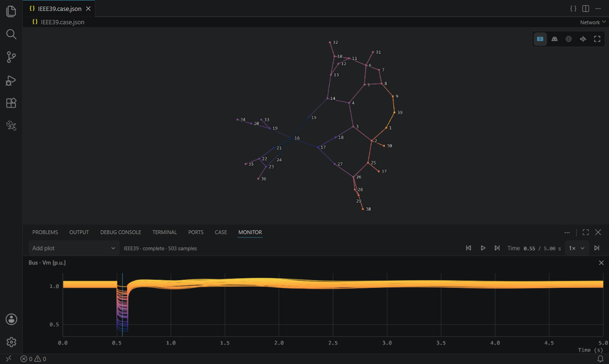

# GridKit Studio

[](https://github.com/lukelowry/gridkit-studio/actions/workflows/ci.yml)
[](https://github.com/ORNL/GridKit/releases/tag/v0.2.0)
[](https://code.visualstudio.com/)
[](https://github.com/lukelowry/gridkit-studio/releases)
[](LICENSE)

View, edit, and simulate [GridKit](https://github.com/ORNL/GridKit) power-system cases in VS Code.



## Install

Download the VSIX from [Releases](https://github.com/lukelowry/gridkit-studio/releases) and install it with **Extensions: Install from VSIX…**, then open any `*.case.json` file. Requires VS Code 1.135 or later and WebGPU.

## GridKit

Studio looks for GridKit in this order:

1. The install folder set in `gridkitStudio.gridkitPath`
2. `PATH`, including dev containers, SSH, and WSL
3. The Docker or Podman image set in `gridkitStudio.gridkitImage`

To use the default image, pull it first:

```sh
docker pull ghcr.io/lukelowry/gridkit:latest
```

## Features

- Network editor
- Case panel for editing fields and mapping them onto the network



_ACTIVSg25k during a fault, with voltage magnitude shown as color and height_

- Diagram editor for control blocks and how they're wired



_An IEEE39 generator with its exciter and stabilizer in the diagram_

- Dynamic simulation and contingency analysis
- Monitor for plotting and playing back signals



_IEEE39 during a fault, with voltage magnitude on the network and in the Monitor_

- Video export to MP4 or WebM
- Chat tools so agents can read your cases and results, and propose edits or simulations for you to approve

## Author

[Luke Lowery](https://lukelowry.github.io/), PhD student in the [Birchfield Research Group](https://birchfield.engr.tamu.edu/) at Texas A&M University · [Google Scholar](https://scholar.google.com/citations?user=CTynuRMAAAAJ&hl=en) · [ORCID](https://orcid.org/0009-0000-0029-3403)

## License

[MIT](LICENSE). See [third-party notices](THIRD_PARTY_NOTICES.md).

Uses [GridKit](https://github.com/ORNL/GridKit) from Oak Ridge National Laboratory and cases from the [Texas A&M Electric Grid Test Case Repository](https://electricgrids.engr.tamu.edu/electric-grid-test-cases/).
